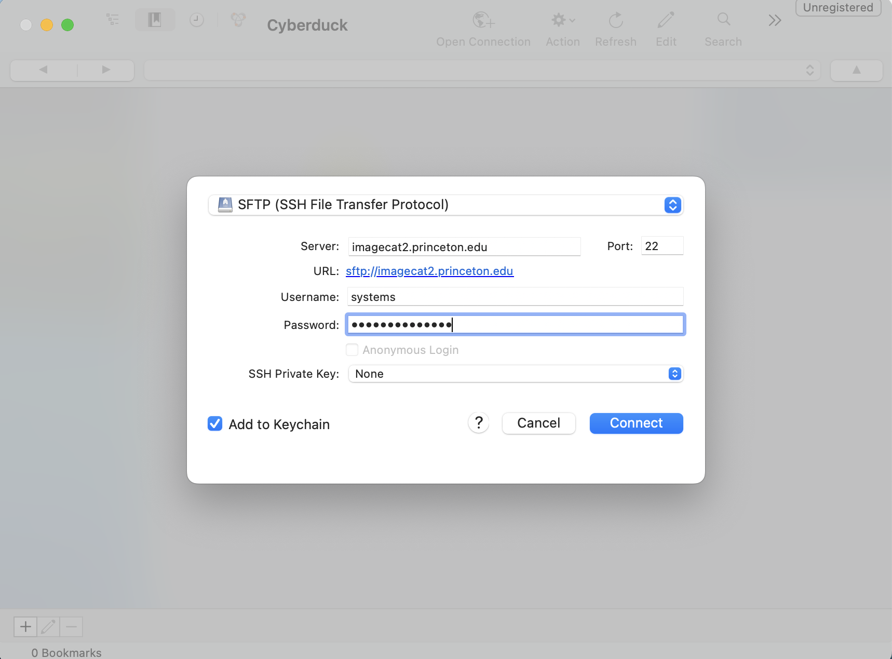
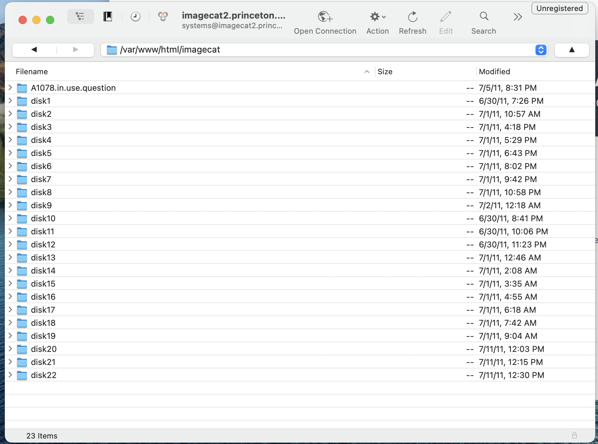

# Image Processing 

This document explains how to move images from a legacy Windows server to the pul-iiif buckets.

## Get images off of the Windows server 

1. You will need an SFTP client (eg. Cyberduck)
2. Connect to the server. The address is `sftp://systems@imagecat2.princeton.edu`. The password is retrieved from 'Image Catalog' on LastPass.

3. Locate the source of the images we want to move. `/var/www/html/imagecat`

4. Move one of these top-level folders down to your local workstation.
5. Track folders that have been moved in this [ticket](https://github.com/pulibrary/imagecat-rails/issues/18) 

## Rename images and upload to s3 

## Test that it is working as expected 

Links: 
https://github.com/samvera/serverless-iiif#creating-tiled-tiffs

Obtain the 'Image Catalog' password for this server in [LastPass](https://www.lastpass.com/)

Once you are have ssh into the shell, navigate to the imagecat sub-directory 

`cd /var/www/html/imagecat`

The images are located on the disk directories (numbered 1-14). 

We want to extract ONLY the original .tiff images and import these to an AmazonS3 bucket. 

They will be extracted to a local drive, where then the images will be moved to the S3 bucket. The images are currently housed on a local machine in the following path:

`cp *.tiff ../../../output/disk14/0001/A1002`

The PUL-iiif server will allow the user to render the images and interact with them as needed. 

Moving the images to the puliiif-staging s3 bucket revealed some things along the way: 

We can not use `aws s3 sync #{source} #{destination}`; this attempts to copy over entire directories, and AWS does not allow for nested directories and files. 

Instead, we can use `aws s3 cp  #{source} #{destination}` which allows for images to be transferred over to the pul-iiif staging s3 bucket. 

`aws s3 cp /Users/faisonr/Downloads/imagecat-images-practice-1/input/disk14/0001/b4491/0000.0143.tiff s3://puliiif-staging/imagecat-disk14-0001-b4491-0000.0143.tif`

The source is the origin of where our images are being transferred from (our local machine). We set the path as the following: /Users/faisonr/Downloads/imagecat-images-practice-1/input/disk14 (downloaded from the legacy server onto a local folder).

source = `/Users/faisonr/Downloads/imagecat-images-practice-1/input/disk14/0001/b4491/0000.0143.tiff`

The destination is where we want the images to ultimately reside for rendering using the iiif system. We set a URL (denoted by ://) and created a shell-script that would automate the process of transferring the images to an appointed destination. 

destination = `s3://puliiif-staging/imagecat-disk14-0001-b4491-0000.0143.tif`

The images were transferred to the puliiif-staging bucket. We then renamed the images (replacing “/“ with “-“) to better conform to naming conventions for the image files. 

The URL, as an example, `https://puliiif-staging.princeton.edu/iiif/2/imagecat-disk14-0001-b4491-0000.0033.tif/full/,500/0/default.jpg` will need to have `.tif` extension removed, otherwise the iiif system will be confused on how to render the image (the default being `.jpg` by design). 



`https://puliiif-staging.princeton.edu/iiif/2/imagecat-disk14-0001-b4491-0000.0033/full/,500/0/default.jpg`

